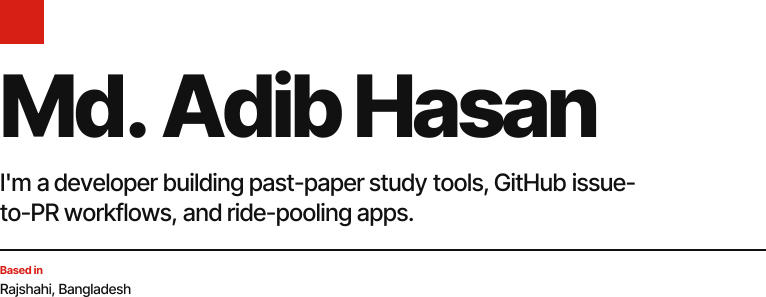
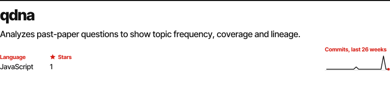
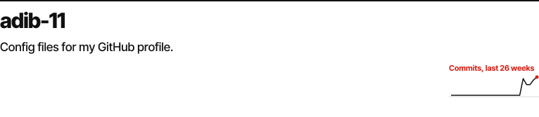
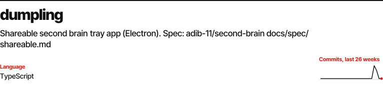
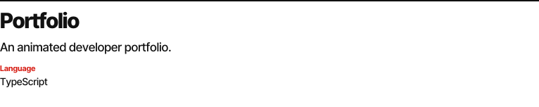
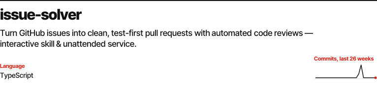
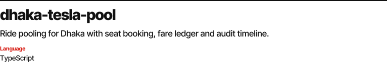
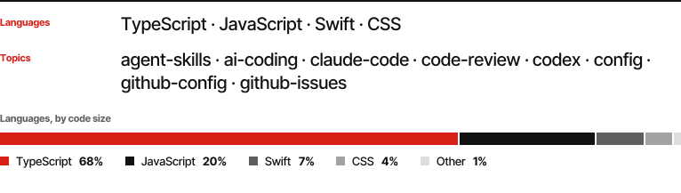
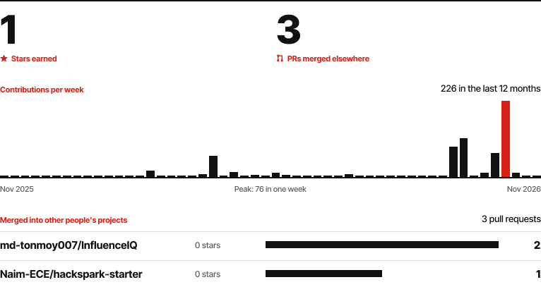

<picture>
  <source media="(prefers-color-scheme: dark)" srcset="frames/hero-dark.svg">
  
</picture>

## About

Associate AI Engineer · ECE Undergrad @ RUET

## Featured Projects

<a href="https://github.com/adib-11/qdna">
<picture>
  <source media="(prefers-color-scheme: dark)" srcset="frames/project-1-dark.svg">
  
</picture>
</a>

<a href="https://github.com/adib-11/adib-11">
<picture>
  <source media="(prefers-color-scheme: dark)" srcset="frames/project-2-dark.svg">
  
</picture>
</a>

<a href="https://github.com/adib-11/dumpling">
<picture>
  <source media="(prefers-color-scheme: dark)" srcset="frames/project-3-dark.svg">
  
</picture>
</a>

<a href="https://github.com/adib-11/Portfolio">
<picture>
  <source media="(prefers-color-scheme: dark)" srcset="frames/project-4-dark.svg">
  
</picture>
</a>

<a href="https://github.com/adib-11/issue-solver">
<picture>
  <source media="(prefers-color-scheme: dark)" srcset="frames/project-5-dark.svg">
  
</picture>
</a>

<a href="https://github.com/adib-11/dhaka-tesla-pool">
<picture>
  <source media="(prefers-color-scheme: dark)" srcset="frames/project-6-dark.svg">
  
</picture>
</a>

## Stack

<picture>
  <source media="(prefers-color-scheme: dark)" srcset="frames/stack-dark.svg">
  
</picture>

## At a glance

<picture>
  <source media="(prefers-color-scheme: dark)" srcset="frames/glance-dark.svg">
  
</picture>

## Contact

[adibhasan.dev](https://adibhasan.dev)
